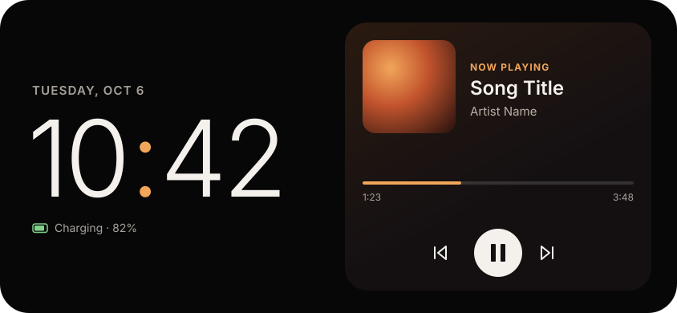
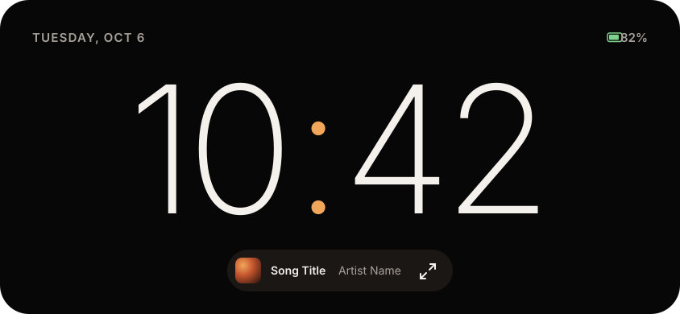

# HorizOn

An open-source Android app that turns a charging phone on its side into a calm desk clock and music display.

> Early development (v0.1 in progress). See [Plan.md](Plan.md) for the roadmap.

| Clock + music | Full clock | Night mode |
|---|---|---|
|  |  |  |

## Features (planned for v0.1)

- Big landscape clock with date and battery/charging status
- Now playing from any music app that publishes a media session, with play/pause, previous and next
- Player background tinted from the album art
- Starts automatically while charging (Android screen saver), or launch it from the app icon
- Burn-in protection, and a pure black background so OLED screens keep unused pixels off
- Optional turn-by-turn directions from Google Maps next to the music (tap the screen, then **Directions**)

Night mode, more clock faces and alarm display are planned for v0.2.

## Privacy

HorizOn has **no internet permission**. It uses notification access to read which song is playing. If you turn on **Directions**, it also reads Google Maps' turn-by-turn notification while you navigate, to show the next turn. It reads no other notifications, keeps directions in memory only, and never stores or sends anything.

## Install

1. Download the latest `HorizOn-vX.Y.Z.apk` from [Releases](https://github.com/Aisu2635/HorizOn/releases) on your phone and open it. Android will ask you to allow installs from your browser or file manager.
2. Turn the phone sideways and open **HorizOn**.
3. Tap **Allow access** on the music card. Because the app isn't from the Play Store, Android 13+ may say the setting is **restricted**: long-press the HorizOn icon → **App info** → **⋮** → **Allow restricted settings**, then try again.
4. Optional: when headphones are connected, tap **Show headphone battery** and allow **Nearby devices**.

Requires Android 8.0 or newer.

## Release (maintainers)

Releases are built and signed by GitHub Actions when a version tag is pushed:

1. Bump `versionCode` and `versionName` in `app/build.gradle.kts` and commit.
2. `git tag v0.1.0 && git push origin v0.1.0` (the tag must match `versionName`).

The workflow needs these repository secrets: `HORIZON_KEYSTORE_BASE64`, `HORIZON_KEYSTORE_PASSWORD`, `HORIZON_KEY_ALIAS`, `HORIZON_KEY_PASSWORD`. To sign locally instead, create a `keystore.properties` in the project root (it is git-ignored) with `storeFile`, `storePassword`, `keyAlias` and `keyPassword`.

## Build

Requirements: Android Studio (recent stable), which includes the JDK and Android SDK.

```bash
./gradlew assembleDebug        # build the debug APK
./gradlew testDebugUnitTest    # unit tests
./gradlew lintDebug            # lint
```

Or open the folder in Android Studio and press Run.

## Contributing

See [CONTRIBUTING.md](CONTRIBUTING.md).

## License

[Apache License 2.0](LICENSE)
