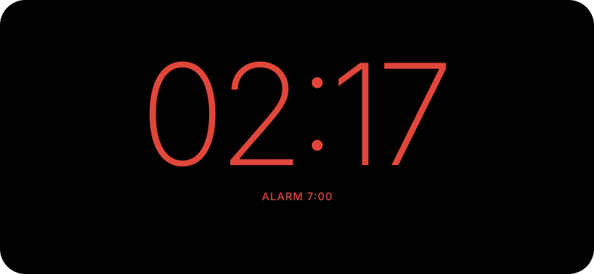

# Deskmode — Plan

> Working name. An open-source Android app that turns a charging phone in landscape into a desk clock and music display, similar in spirit to iOS StandBy.

## 1. Vision

Put your phone on its side on a charger, and it becomes a calm, glanceable desk gadget. It shows a large clock, the song currently playing in any music app (Spotify, YouTube Music, etc.) with controls, and a dim red night mode for bedside use.

## 2. Screens

### Split view: clock + music player
The default when something is playing. Clock on the left; player card on the right, tinted from the album art.


### Full clock
The default when nothing is playing, or after a swipe. A compact "now playing" pill links back to the split view.


### Night mode
Red on pure black and very dim. Turns on automatically in a dark room or on a schedule.



Interactive mockups: https://claude.ai/artifact/4ZfPks3beKXBfjN2ZHSFdD

## 3. Features

### MVP (v0.1)
- [ ] Full-screen landscape clock (12/24h, date, battery/charging status)
- [ ] Now playing from any app that publishes a MediaSession: title, artist, album art, progress
- [ ] Playback controls: play/pause, previous, next
- [ ] Split view and full clock; swipe to switch between them
- [ ] Album-art-tinted player background (Palette API)
- [ ] Auto-start when charging via Android's screensaver (`DreamService`)
- [ ] Manual launch from the app icon
- [ ] Burn-in protection: subtle pixel shift every few minutes
- [ ] Onboarding that explains and requests notification access

### v0.2
- [ ] Night mode (ambient light sensor + schedule)
- [ ] Multiple clock faces: minimal, flip, analog
- [ ] Accent color picker and "follow album art" option
- [ ] Next alarm display

### Later ideas
- [ ] Widgets: weather, calendar's next event
- [ ] Seek by tapping the progress bar
- [ ] Per-charger profiles (desk vs. nightstand)
- [ ] Home-screen widget / quick settings tile to launch
- [ ] Tablet layouts

## 4. Tech stack

| Area | Choice |
|---|---|
| Language | Kotlin |
| UI | Jetpack Compose + Material 3 (custom theme) |
| Min / target SDK | minSdk 26 (Android 8.0), target latest stable |
| Build | Gradle Kotlin DSL + version catalog (`libs.versions.toml`) |
| Architecture | Single-activity, MVVM, `StateFlow` |
| DI | Hilt (or manual DI to keep it small; decide in M1) |
| Settings storage | DataStore (Preferences) |
| Images / colors | `androidx.palette` for album art colors |
| Testing | JUnit, Turbine for flows, Compose UI tests |
| CI | GitHub Actions: lint, unit tests, debug APK artifact |

## 5. How it works

### Auto-launch while charging
- Implement `DeskDreamService : DreamService` and host the Compose UI inside it (via `ComposeView` with a lifecycle/saved-state owner set up manually).
- Users select Deskmode under **Settings → Display → Screen saver** and pick "While charging." Onboarding deep-links there.
- Also provide `DeskActivity` (landscape, `FLAG_KEEP_SCREEN_ON`, immersive) for manual launch and for devices whose OEM hides the screensaver setting.

### Reading now playing
- `MediaListenerService : NotificationListenerService` makes the app eligible for media session access.
- `MediaSessionManager.getActiveSessions(componentName)` plus `addOnActiveSessionsChangedListener` gives the active `MediaController`s.
- Pick the session that is playing (or the most recent one) and observe `MediaController.Callback` for metadata and playback state.
- Controls go through `controller.transportControls` (`play`, `pause`, `skipToNext`, `skipToPrevious`).
- Progress is computed from `PlaybackState.position`, `lastPositionUpdateTime`, and `playbackSpeed` and ticked locally.
- Expose everything as a `StateFlow<NowPlaying?>` from a `MediaRepository`.

### Display behavior
- Keep screen on only while showing; respect battery saver.
- Burn-in: shift the root layout by a few px on a timer; avoid static bright elements.
- Night mode: `SensorManager` light sensor with hysteresis and a schedule fallback; force red palette and lower window brightness.

## 6. Permissions

| Permission | Why |
|---|---|
| Notification access (`BIND_NOTIFICATION_LISTENER_SERVICE`) | Required to read media sessions from other apps. We never read or store notification content. |
| `BIND_DREAM_SERVICE` (on the service) | Lets the system run us as a screensaver |

No internet permission in the MVP. This is a privacy point worth stating in the README.

## 7. Project structure

```
deskmode/
├── app/
│   └── src/main/java/dev/deskmode/
│       ├── DeskActivity.kt
│       ├── dream/DeskDreamService.kt
│       ├── media/
│       │   ├── MediaListenerService.kt
│       │   ├── MediaRepository.kt
│       │   └── NowPlaying.kt
│       ├── clock/ClockState.kt
│       ├── settings/SettingsRepository.kt
│       └── ui/
│           ├── DeskScreen.kt        # pager: split / full clock
│           ├── SplitView.kt
│           ├── FullClock.kt
│           ├── NightMode.kt
│           ├── PlayerCard.kt
│           ├── onboarding/
│           └── theme/
├── docs/screens/                    # mockups used in this plan + README
├── .github/workflows/ci.yml
├── README.md
├── LICENSE
├── CONTRIBUTING.md
└── Plan.md
```

## 8. Milestones

1. **M0: Repo setup.** Gradle project, Compose, version catalog, CI, license, README skeleton.
2. **M1: Clock.** `DeskActivity` in landscape with full clock, keep-screen-on, immersive mode, burn-in shift.
3. **M2: Media.** Notification listener, `MediaRepository`, player card with controls, onboarding for permission.
4. **M3: Layout.** Split view, swipe between views, Palette tinting, animations.
5. **M4: Screensaver.** `DeskDreamService`, settings deep-link, test on Pixel and Samsung.
6. **M5: Polish and release v0.1.** Settings screen, icons, screenshots, GitHub release with APK.
7. **M6: v0.2.** Night mode, clock faces, alarm display.

## 9. Open source and GitHub

- **License:** Apache-2.0 (patent grant, common for Android) or MIT; decide before first push.
- **Repo:** public on GitHub with topics `android`, `jetpack-compose`, `standby`, `desk-clock`, `music`.
- **README:** screenshots, features, privacy note, install (GitHub Releases APK), build instructions.
- **CONTRIBUTING.md:** setup, code style (ktlint/detekt), branch and PR conventions.
- **Issue templates:** bug report (include device, Android version, music app) and feature request.
- **Releases:** tag `v0.1.0`; CI builds and attaches a signed APK. Consider F-Droid later (no proprietary deps needed).
- Avoid Apple's "StandBy" name and any music service logos in the app or store listing.

## 10. Risks and open questions

- **OEM differences:** some manufacturers hide or change the screensaver setting. The manual launch path covers this.
- **Inconsistent metadata:** some apps publish missing album art or odd positions. Show graceful fallbacks.
- **Multiple sessions:** decide which session wins if two apps are active.
- **Battery and heat:** keep frame updates minimal (clock updates once a minute; progress bar redraws only while visible).
- **Final name:** "Deskmode" is a placeholder; check GitHub and Play Store for conflicts.

## 11. Kickoff prompt for Claude Code

> Read Plan.md. Set up milestone M0: a new Android project in Kotlin with Jetpack Compose, Gradle Kotlin DSL, a version catalog, package `dev.deskmode`, minSdk 26, a GitHub Actions workflow that runs lint and unit tests, an Apache-2.0 LICENSE, and a README using the screens in docs/screens. Then start M1.
